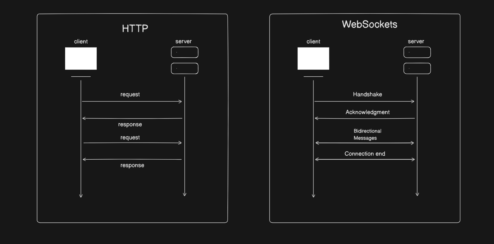

# Websockets

WebSockets are a protocol for establishing a continuous, bidirectional communication channel between a client (like a web browser) and a server. This protocol is particularly useful for real-time applications, like chat apps, live notifications, online gaming, and financial applications that require real-time updates.

## Key Features of WebSockets:

- **Full-duplex communication:** Once a WebSocket connection is established, both the client and server can send messages to each other independently, allowing for two-way communication without the need for multiple HTTP requests.

- **Persistent connection:** Unlike HTTP, where a new connection is created for every request/response, WebSocket creates a single, long-lived connection that stays open for the entire duration of the communication.

- **Low latency:** Since the connection is already established and does not need to be re-opened, the communication can occur with much less delay compared to traditional HTTP requests.

- **Efficient:** WebSockets use less overhead compared to polling or long-polling methods, where the client repeatedly requests data from the server. Instead, data is pushed from the server to the client when it is available.

## How WebSockets Work:

- **Handshake:** The client initiates a WebSocket connection by sending an HTTP request with an "Upgrade" header, asking the server to switch the connection protocol to WebSockets.

Example HTTP request:

makefile

```
GET /chat HTTP/1.1
Host: example.com
Upgrade: websocket
Connection: Upgrade
Sec-WebSocket-Key: dGhlIHNhbXBsZSBub25jZQ==Sec-WebSocket-Version: 13
```

If the server supports WebSockets, it responds with a 101 status code (Switching Protocols), confirming the switch.

- **Data Transfer:** Once the handshake is complete, the WebSocket connection is open. The server and client can now send messages back and forth. These messages can be sent in either direction without needing to initiate a new HTTP request.

- **Closing the connection:** Either the client or the server can initiate the closure of the WebSocket connection. A special "close" frame is sent, and both sides clean up resources associated with the connection.

### HTTP vs Websockets




